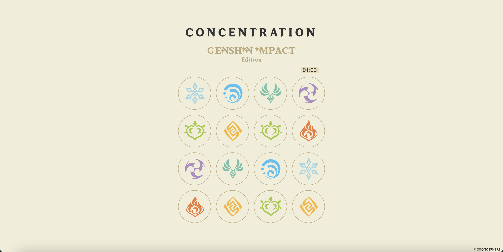
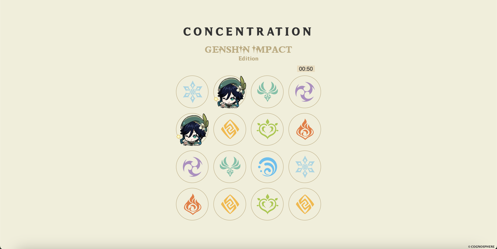

# Browser-based-Game
## Concentration -Genshin Impact Edition-
Inspired by the hit action rpg, <a href="https://genshin.hoyoverse.com/en/">Genshin Impact</a>, this special edition version of Concentration features 8 characters that are currently available in the game. The game is designed to be simple, minimalistic, responsive, and fun.

## Technologies Used
HTML5, CSS3, and JavaScript

## Screenshots
Initial Screen:

Game in Progress:

## How to Play
- The game consists of a single player
- Player will see a 4x4 board (16 circles) displayed automatically
- All circles will have a facedown and faceup state
- When the game starts: 
    - All circles will begin in the facedown state
    - A 1 minute countdown timer will begin automatically
- Player will need to click on any circle to begin playing
    - The selected circle will return faceup upon being clicked
- Player will then need to click on another circle
    - The selected circle cannot be one that is already faceup
- If the picture on the first selected circle matches the picture on the second selected circle, then both circles will remain situated faceup
- If the picture on the first selected circle doesn't match the picture on the second selected circle, then both circles will return facedown and a "TRY AGAIN" message will populate on the screen
- The player wins if:
    - All circles have entered the faceup state and the countdown timer is > 0
    - A "YOU WIN!!!" message populates on the screen
- The player loses if:
    - All circles have not entered the faceup state and the countdown timer is < 0
    - A "YOU LOSE..." message populates on the screen
- Whether the player wins or loses, the game will automatically shuffle the circles and restart from the beginning after a short period of time

<a href="https://bridgeot.github.io/Browser-based-Game/">CLICK HERE TO PLAY NOW!</a>

## Next Steps
- Add a pause/unpause game feature
- Increase gameboard size and add additional images

## References
- All images used in the making of this game were derived from the non-official <a href="https://genshin-impact.fandom.com/wiki/Genshin_Impact_Wiki">Genshin Impact Wiki</a> page.
- Both custom fonts being utilized in the game are inspired by Genshin Impact and recreated by fans for reuse. Credits go to <a href="https://twitter.com/NekoJinnyArt">@NekoJinnyArt</a> on Twitter and <a href="https://www.dafontfree.io/genshin-impact-font/">DaFont</a>.